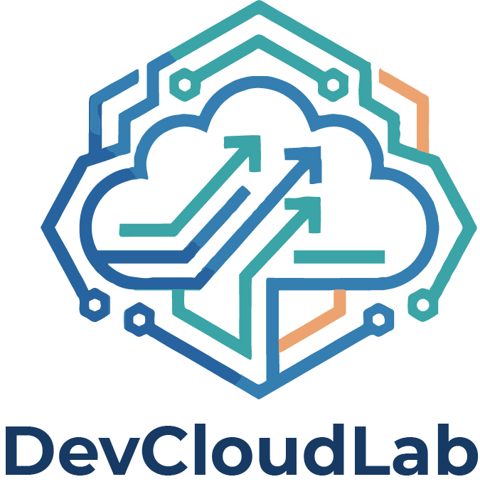

# Benefits of automating deployments with Flux CD

*Section 1, Lecture 4 — from the **Flux CD** course by [DevCloudLab](https://devcloudlab.com).*

---

## What you'll learn

This lecture covers five key benefits of using Flux CD to automate your Kubernetes deployments:

1. **Consistency** — Eliminate configuration drift and ensure your cluster matches your Git repository
2. **Speed** — Deploy changes automatically without manual handoffs or ceremony
3. **Simplicity** — Roll back to any previous state by reverting a Git commit
4. **Collaboration** — Use Git pull requests for team review and approval of infrastructure changes
5. **Observability** — Maintain a complete audit trail of every deployment

## Key Concepts

**Configuration Drift** — When your cluster state diverges from your intended configuration because manual changes were made outside your deployment process. Flux CD prevents this by continuously enforcing your desired state.

**GitOps** — An operational model where Git is the single source of truth for infrastructure and application state. All changes flow through Git, ensuring auditability and repeatability.

**Canary Deployment** — A deployment strategy where you first roll out a change to a small subset of traffic or users before pushing to everyone. Flux integrates with tools that support this strategy.

**Multi-Tenancy** — Isolating several teams or applications *inside one cluster*, so each tenant has its own namespace, its own service account and its own Flux sources, and cannot reconcile into another tenant's namespace.

**Multi-Cluster Management** — A separate pattern: one Flux installation (or one management cluster) reconciles the manifests for many clusters, so the same Git workflow drives one cluster or dozens.

## Why These Benefits Matter

**For Development Teams:** Speed means you can deploy bug fixes and features without waiting for ops. Collaboration means your infrastructure goes through code review just like your application code.

**For Operations Teams:** Consistency and observability mean you can trust your infrastructure state. Rollbacks mean you can respond to incidents quickly without manual investigation.

**For Compliance and Auditing:** Every change is a Git commit with a timestamp and author. Your audit log is comprehensive and tamper-evident.

## Getting Started with Flux

To understand how Flux delivers these benefits, you need to:

1. Understand Git as a version control system and how to write basic YAML manifests
2. Know the Kubernetes API objects (Deployments, Services, etc.) that Flux manages
3. Be able to read and interpret Flux resources (GitRepository, Kustomization, HelmRelease)

You do not need any of this yet — we cover it as we go. Flux's own resources (GitRepository, Kustomization, HelmRelease) start in the next section, where you install and bootstrap Flux and sync your first application.

## Common Use Cases

**Automated Deployments:** Push code to Git, Flux automatically deploys it to your Kubernetes cluster.

**Environment Promotion:** Different Git branches or folders represent dev, staging, and production. Flux keeps each environment in sync with its corresponding branch.

**Infrastructure as Code:** Your entire cluster configuration lives in Git. New team members can understand your infrastructure by reading the repository.

**Disaster Recovery:** To restore a cluster, just point Flux at your Git repository. Flux will recreate the entire desired state.

## Further Reading

- [Flux Documentation — Core Concepts](https://fluxcd.io/docs/)
- [GitOps Principles](https://www.gitops.tech/)
- [Kubernetes API Reference](https://kubernetes.io/docs/reference/generated/kubernetes-api/v1.37/)
- [Git Basics](https://git-scm.com/doc)

## What Happens Next

The next lectures will walk you through hands-on examples: setting up a Flux repository, deploying applications with Kustomization, managing Helm releases with Flux, and monitoring your deployments.

---

  

  <strong>Built by DevCloudLab</strong> 
  Hands-on cloud-native courses — Kubernetes, GitOps, CI/CD and the cloud. 
  <a href="https://devcloudlab.com"><strong>Visit DevCloudLab.com →</strong></a>

