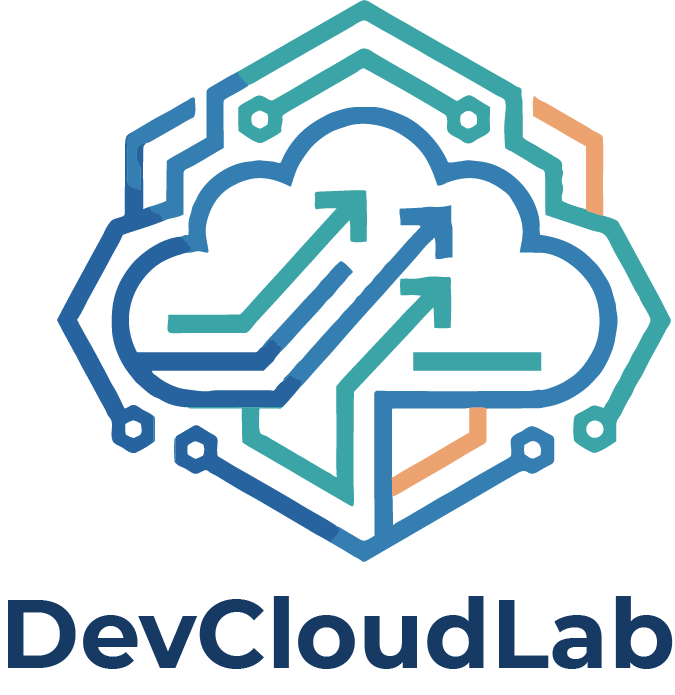

<a href="https://devcloudlab.com"></a>

# Restructuring the repository to follow the multi-tenancy approach

*Section 4, Lecture 5, from the **Flux CD** course by [DevCloudLab](https://devcloudlab.com).*

---

## What you'll learn

- Distinguish the multi-tenancy repository pattern from the mono-repo and repo-per-environment approaches
- Separate admin-team and application-team responsibilities within one Flux-managed repository
- Name the tenant boundaries (the `apps` namespace and the `dev` service account) that the next two lectures enforce with `serviceAccountName`
- Rebuild a fresh repository whose `infrastructure/controllers` directory both clusters reconcile through one `infra-controllers` Kustomization
- Set indefinite remediation retries on a cluster-wide HelmRelease so a failed first install keeps retrying

## Overview

In this lesson, we explored the **multi-tenancy approach** to organizing Flux CD repositories. This pattern separates concerns between cluster administrators and application teams, enabling fine-grained access control and team autonomy while maintaining global cluster policies.

## Key Concepts

### Repository Structures

**Mono-Repo Approach**: All code in one repository, all teams have access. Simple but not scalable for large organizations.

**Repo-Per-Environment**: Separate repositories for each environment (dev, staging, production). Adds control but doesn't solve multi-team coordination.

**Multi-Tenancy**: Separate responsibility between admin and application teams within a structured repository. The admin team controls infrastructure; application teams control their deployments within admin-enforced boundaries.

### Admin Team Responsibilities

* Set up environments on separate namespaces (or separate clusters)
* Maintain cluster-wide resources: ingress controllers, certificate managers, cluster auto-scalers
* Onboard new application teams by creating Kustomization resources
* Enforce cluster policies through Kustomization configuration
* Configure service account bindings for team-scoped RBAC

### Application Team Responsibilities

* Own and maintain their application manifests (Deployments, StatefulSets, Services, etc.)
* Package applications using Helm charts or Kustomize patches
* Manage application parameters for different environments (staging, production)
* Implement image promotion across environments using Flux GitOps automation
* Deploy only to their designated namespaces

### Advantages of Multi-Tenancy

* **Separation of Concerns**: Admin and dev teams have clear, separate responsibilities
* **Security**: Teams cannot access or modify other teams' resources
* **Scalability**: Easily onboard new teams with consistent policies
* **Autonomy**: Application teams move at their own pace within admin boundaries
* **Consistency**: Global policies enforced at the cluster level

## Core Patterns

### The admin team's infrastructure Kustomization

This lecture builds one Flux Kustomization, `infra-controllers`, and adds it to each cluster's directory. Both point at the same `infrastructure/controllers` folder:

```yaml
apiVersion: kustomize.toolkit.fluxcd.io/v1
kind: Kustomization
metadata:
  name: infra-controllers
  namespace: flux-system
spec:
  interval: 1h
  retryInterval: 5m
  timeout: 5m
  sourceRef:
    kind: GitRepository
    name: flux-system
  path: ./infrastructure/controllers
  prune: true
  wait: true
```

Save it as `clusters/staging/infrastructure.yaml` and again, unchanged, as `clusters/production/infrastructure.yaml`.

### Where the tenant boundaries come from (next two lectures)

This lecture sets no service account and creates no tenant namespace yet. The next two lectures onboard the dev team, and they use these names:

- the tenant namespace is `apps`;
- the tenant's service account is `dev`, in the `apps` namespace;
- the tenant's Flux Kustomization is also named `dev`, lives in `apps`, and sets `serviceAccountName: dev`.

```yaml
apiVersion: kustomize.toolkit.fluxcd.io/v1
kind: Kustomization
metadata:
  name: dev
  namespace: apps
spec:
  interval: 1m0s
  path: ./
  prune: false
  serviceAccountName: dev
  sourceRef:
    kind: GitRepository
    name: dev
```

Because Flux reconciles this Kustomization as the `dev` service account, and that account is only bound to a role inside `apps`, the dev team's manifests can only create resources in the `apps` namespace.

## Essential Commands

### Bootstrap Flux on a Cluster

Export your GitLab personal access token once in your shell (it needs the `api` scope), then bootstrap the staging cluster:

```bash
export GITLAB_TOKEN=<your-personal-access-token>

kubectl config use-context kind-staging
flux bootstrap gitlab \
  --owner=<your-gitlab-username> \
  --repository=myfluxrepo-2026 \
  --branch=main \
  --path=clusters/staging \
  --token-auth \
  --personal
```

This command installs Flux controllers, creates the flux-system namespace, and sets up GitRepository and Kustomization resources. `--token-auth` makes Flux authenticate to GitLab with the token instead of a deploy key.

Repeat it for production: switch to `kind-production` and change the path to `clusters/production`. Then pull what Flux committed into your local copy:

```bash
git pull origin main
git branch --set-upstream-to=origin/main main
```

### View Flux Reconciliation Status

```bash
flux get all -A
```

Lists all Flux resources (GitRepositories, HelmRepositories, Kustomizations, HelmReleases) across namespaces and their reconciliation status.

### Manually Trigger Reconciliation

```bash
flux reconcile source git flux-system
flux reconcile kustomization infra-controllers --namespace flux-system
```

Forces Flux to immediately apply changes from Git, rather than waiting for the next interval. Run it on both clusters, switching the kubectl context between them.

### Check HelmRelease Status

```bash
kubectl get helmrelease -A
kubectl describe helmrelease <name> -n <namespace>
```

Shows whether Helm charts deployed successfully and details of any failures.

### Set Remediation on a HelmRelease

```yaml
spec:
  install:
    remediation:
      retries: -1
```

By default, if the very first install of a Helm release fails (the chart cannot be pulled, or something it needs in the cluster is not up yet), the Helm controller gives up and leaves the release in a failed state until somebody intervenes. `retries: -1` tells it to keep retrying indefinitely instead, which is what you want for a cluster-wide component the rest of the platform depends on.

### View Cluster Directory Structure

```bash
tree .
```

Shows the Git repository structure that Flux created, including the `clusters/` and `infrastructure/` directories. If `tree` is not on your machine, install it with your package manager (on Ubuntu, `sudo apt install tree`).

## What the Lecture Builds

The lecture creates exactly four files by hand, and both clusters read the same directory:

```
myfluxrepo-2026/
├── clusters/
│   ├── staging/
│   │   ├── flux-system/                 # created by flux bootstrap
│   │   └── infrastructure.yaml          # Flux Kustomization → ./infrastructure/controllers
│   └── production/
│       ├── flux-system/                 # created by flux bootstrap
│       └── infrastructure.yaml          # Flux Kustomization → ./infrastructure/controllers
└── infrastructure/
    └── controllers/
        ├── nginx-ingress-controller.yaml   # a note; ingress-nginx is installed with kubectl
        └── flux-operator-dashboard.yaml    # HelmRepository + HelmRelease for the dashboard
```

There is no `kustomization.yaml` inside `infrastructure/controllers`. When a Flux Kustomization's `path` has none, Flux generates one covering every manifest in that directory, which is why the two files above are applied without you listing them anywhere.

The `HelmRepository` and the `HelmRelease` live in the same file on purpose: the release names the repository in its `sourceRef`, and the Kustomization sets `prune: true`, so a release whose repository is not in Git ends up with no chart source.

## Illustrative: Where the Infrastructure Can Grow

This is an illustration, not something to build in this lecture. Once staging and production stop needing identical infrastructure, the usual next step is a Kustomize base with per-environment overlays:

```
myfluxrepo-2026/
├── clusters/
│   ├── staging/
│   │   └── infrastructure.yaml          # Flux Kustomization → ./infrastructure/overlays/staging
│   └── production/
│       └── infrastructure.yaml          # Flux Kustomization → ./infrastructure/overlays/production
└── infrastructure/
    ├── base/
    │   ├── ingress-controller.yaml
    │   ├── certificate-manager.yaml
    │   └── kustomization.yaml
    ├── controllers/
    │   ├── flux-operator-dashboard.yaml  # HelmRepository + dashboard HelmRelease
    │   └── kustomization.yaml
    └── overlays/
        ├── staging/
        │   └── kustomization.yaml      # Staging-specific patches
        └── production/
            └── kustomization.yaml      # Production-specific patches
```

The lecture's single `infra-controllers` Kustomization pointing at `./infrastructure/controllers` is all the next two lectures need. Tenants are added in a separate `tenants/` directory, which the next lecture creates.

## API Versions (Flux v2.9.4)

| Resource | API Version |
|----------|-------------|
| HelmRelease | helm.toolkit.fluxcd.io/v2 |
| HelmRepository | source.toolkit.fluxcd.io/v1 |
| GitRepository | source.toolkit.fluxcd.io/v1 |
| Kustomization | kustomize.toolkit.fluxcd.io/v1 |
| Alert | notification.toolkit.fluxcd.io/v1beta3 |
| Provider | notification.toolkit.fluxcd.io/v1beta3 |

Ensure all manifests use these versions. Older versions (v2beta1, v1beta2) were removed in Flux v2.7.0.

## Common Issues and Solutions

**Issue**: HelmRelease fails with "no matches for kind HelmRelease in version helm.toolkit.fluxcd.io/v2beta1"

**Solution**: Update the apiVersion to `helm.toolkit.fluxcd.io/v2` in your manifest.

**Issue**: Dashboard pod crashes or doesn't start

**Solution**: Check the chart source first: `kubectl get helmrepository -n flux-system` must list the repository the release names in its `sourceRef`. If that is fine, add `install.remediation.retries: -1` to the HelmRelease spec so a failed first install keeps retrying instead of staying failed.

**Issue**: Git push requires credentials every time

**Solution**: Use `git config --global credential.helper store` to cache your personal access token, or use the GitLab CLI (`glab auth login`) to set up authentication.

**Issue**: kind cluster ports conflict with existing services

**Solution**: Modify the kind cluster config to use different host port mappings (e.g., staging on 8080, production on 8081).

## Further Reading

- [Flux CD Documentation](https://fluxcd.io/docs/)
- [Flux Multi-Tenancy Guide](https://fluxcd.io/flux/installation/configuration/multitenancy/)
- [Kustomize Overlays](https://kubectl.docs.kubernetes.io/references/kustomize/glossary/#overlay)
- [Ways of Structuring Your Repositories](https://fluxcd.io/flux/guides/repository-structure/)
- [Flux Cluster Role Aggregations (Namespace RBAC)](https://fluxcd.io/flux/installation/configuration/multitenancy/#flux-cluster-role-aggregations)
- [HelmRelease API Reference](https://fluxcd.io/docs/components/helm/)
- [Kustomization API Reference](https://fluxcd.io/docs/components/kustomize/)

---

<p align="center">
  <a href="https://devcloudlab.com"></a>
</p>

<p align="center">
  <strong>Built by DevCloudLab</strong><br>
  Hands-on cloud-native courses: Kubernetes, GitOps, CI/CD and the cloud.<br>
  <a href="https://devcloudlab.com"><strong>Visit DevCloudLab.com →</strong></a>
</p>
